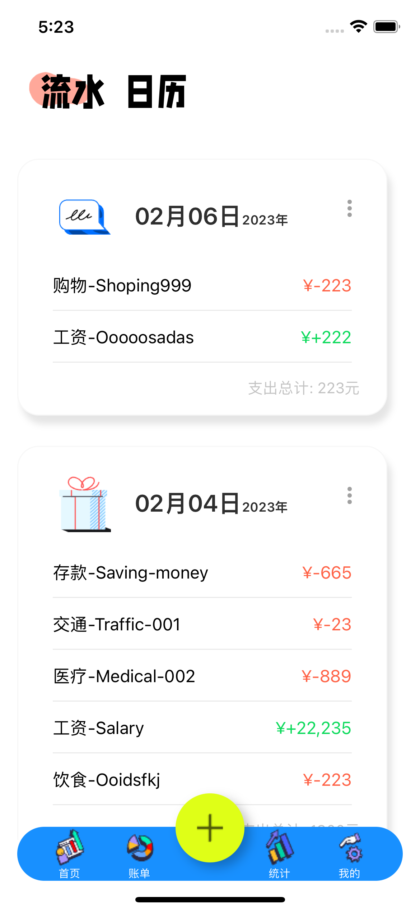
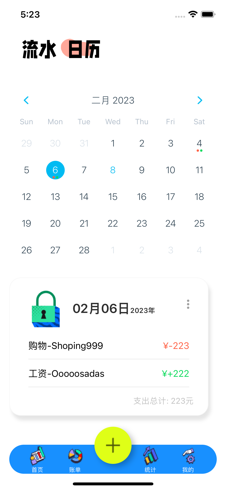
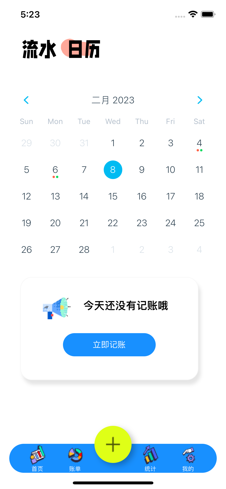
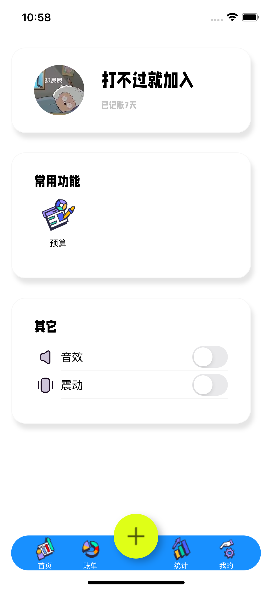

# account-book
## 项目依赖列表
* `react navigation` --项目路由
* `react native element` --项目ui框架
* `AsyncStorage` --项目数据本地存储
* `react-native-calendars` --日历组件
* `react-native-haptic-feedback` --ios设备的haptic反馈
* `react-redux` --app的全局状态管理库
* `reduxjs/toolkit` --app与redux的交流工具库

## 项目截图
    
    
 